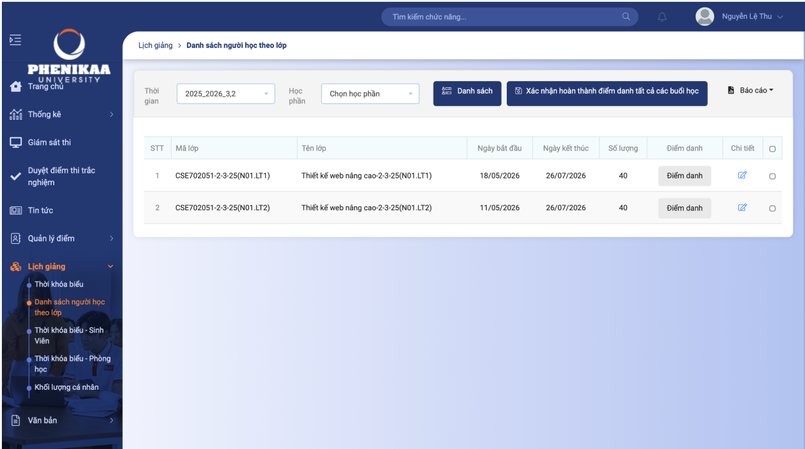

# TASK.md - Danh Sách Nhiệm Vụ Bài Tập Lớn Cuối Kỳ (Bài Cá Nhân)

**Môn học:** Web Nâng Cao  
**Lớp:** N01_LT1  
**Trường:** Đại học Phenikaa  
**Repository:** [Ndtunas/web-nang-cao-cuoi-ky](https://github.com/Ndtunas/web-nang-cao-cuoi-ky)  
**Sinh viên thực hiện:** Ndtunas (`duytuan10a9@gmail.com`)  

---

## 📋 Tổng Quan Tiến Độ Dự Án

- [x] **Câu 1:** User Stories (Câu chuyện người dùng) `[1.0 điểm]` (Hoàn thành code/nghiệp vụ hỗ trợ)
- [x] **Câu 2:** Phân tích Yêu cầu & Mô hình hóa Đối tượng `[1.0 điểm]` (Hoàn thành 21 entities & relations)
- [x] **Câu 3:** Sơ đồ Cấu trúc & Thuật toán (Class & Sequence/Activity Diagrams) `[1.0 điểm]` (Hoàn thành 100% tại thư mục /diagrams)
- [x] **Câu 4:** Xây dựng Backend & API CRUD (NestJS) `[1.0 điểm]` (Hoàn thành 100%)
- [x] **Câu 5:** Xây dựng Frontend UI & Màn hình mẫu `[1.0 điểm]` (Hoàn thành 100%)
- [x] **Câu 6:** Kết nối Cơ sở dữ liệu & ORM `[1.0 điểm]` (Hoàn thành 100%)
- [x] **Câu 7:** Xử lý Lỗi, Unit Test & Kiểm thử Hệ thống `[1.0 điểm]` (Hoàn thành 100%)
- [ ] **Câu 8:** Đóng gói Báo cáo Bản in & Hồ sơ Nộp bài `[1.0 điểm]` (Sinh viên tự làm báo cáo & video demo)
- [x] **Câu 9:** Đánh giá Đạo đức, Pháp lý & An ninh An toàn `[1.0 điểm]` (Hoàn thành 100%)
- [x] **Câu 10:** Quản lý Lịch sử Commit Git `[1.0 điểm]` (Hoàn thành 100% config & commit)

---

## 📝 Chi Tiết Nhiệm Vụ (Task Breakdown)

### 🔹 Câu 1: Trình bày Câu chuyện người dùng (User Stories) [1.0 điểm]
- [x] Xác định các nhóm người dùng chính của hệ thống (Ví dụ: Admin, User, Manager...).
- [x] Xây dựng danh sách User Stories chi tiết theo mẫu standard (`Là [vai trò], tôi muốn [hành động] để [mục đích]`):
  - [x] *User Story 1:* Xác thực & Phân quyền (Đăng ký, Đăng nhập, Đăng xuất, Quên mật khẩu).
  - [x] *User Story 2:* Quản lý thông tin cá nhân / Profile người dùng.
  - [x] *User Story 3:* Thao tác với các thực thể chính của hệ thống (Xem, Thêm, Sửa, Xóa).
  - [x] *User Story 4:* Tìm kiếm, Lọc và Phân trang dữ liệu.
  - [x] *User Story 5:* Báo cáo & Thống kê dữ liệu cho Quản trị viên.

---

### 🔹 Câu 2: Phân tích Yêu cầu, Đối tượng, Mối quan hệ & Phương thức [1.0 điểm]
- [x] **Phân tích Yêu cầu Nghiệp vụ (Business Requirements):**
  - [x] Liệt kê chi tiết các yêu cầu chức năng (Functional Requirements).
  - [x] Liệt kê chi tiết các yêu cầu phi chức năng (Non-functional Requirements).
- [x] **Mô hình hóa Đối tượng (Domain Model):**
  - [x] Xác định các đối tượng trung tâm (Entities) và thuộc tính (Attributes) tương ứng.
  - [x] Định nghĩa các phương thức hoạt động (Methods / Actions) cho từng đối tượng.
  - [x] Xác định mối quan hệ giữa các đối tượng (1-1, 1-N, N-N).

---

### 🔹 Câu 3: Thiết kế Sơ đồ UML (Class Diagram & Sequence/Activity Diagrams) [1.0 điểm]
- [x] **Class Diagram (Sơ đồ cấu trúc lớp - Ít nhất 01 sơ đồ):**
  - [x] Vẽ sơ đồ tổng quan thể hiện các Entity, Attribute, Method và Relationship (Inheritance, Association, Aggregation, Composition). (Đã khởi tạo tại diagrams/class_diagram.md)
- [x] **Sequence / Activity Diagrams (Sơ đồ tuần tự / Sơ đồ hoạt động - Ít nhất 05 sơ đồ):**
  - [x] Sơ đồ 1: Luồng Đăng nhập & Xác thực JWT. (Đã khởi tạo tại diagrams/seq_login_auth.md)
  - [x] Sơ đồ 2: Luồng Xem & Tìm kiếm danh sách dữ liệu. (Đã khởi tạo tại diagrams/seq_view_search.md)
  - [x] Sơ đồ 3: Luồng Tạo mới / Đăng ký đối tượng. (Đã khởi tạo tại diagrams/seq_create_entity.md)
  - [x] Sơ đồ 4: Luồng Cập nhật & Kiểm tra ràng buộc dữ liệu. (Đã khởi tạo tại diagrams/seq_update_constraints.md)
  - [x] Sơ đồ 5: Luồng Xóa đối tượng & Xử lý quan hệ dữ liệu liên quan. (Đã khởi tạo tại diagrams/seq_delete_cascade.md)

---

### 🔹 Câu 4: Thực hiện API CRUD & Xử lý Nghiệp vụ Backend [1.0 điểm]
- [x] Khởi tạo khung dự án Backend theo mô hình phân lớp (Layered Architecture - NestJS):
  - [x] Khởi tạo module, controller, service, dto, entity structure.
- [x] Xây dựng đầy đủ các API CRUD chuẩn RESTful:
  - [x] `GET /api/...` - Lấy danh sách (hỗ trợ pagination, search, filter).
  - [x] `GET /api/.../:id` - Lấy thông tin chi tiết.
  - [x] `POST /api/...` - Tạo mới dữ liệu (Validate với DTO & class-validator).
  - [x] `PUT / PATCH /api/.../:id` - Cập nhật dữ liệu.
  - [x] `DELETE /api/.../:id` - Xóa dữ liệu.
- [x] Triển khai các business logic phức tạp theo phân tích từ Câu 1, 2, 3.

---

### 🔹 Câu 5: Thiết kế & Triển khai UI Frontend (Màn hình mẫu) [1.0 điểm]
- [x] Khởi tạo khung dự án Frontend (React / Next.js / Vue / HTML-CSS-JS).
- [x] Xây dựng giao diện responsive, hiện đại, tuân thủ nguyên tắc thiết kế UI/UX.
- [x] **Triển khai Màn hình mẫu / Layout theo yêu cầu:**
  - [x] Thực hiện đúng bố cục theo hình ảnh thiết kế mẫu:  
      
    *(Xem file chi tiết tại: [sample_front_end.png](file:///mnt/workspace/999_personal/000-zon-web-nang-cao-cuoi-ky/sample_front_end.png))*
- [x] Tích hợp API Backend vào các thành phần UI (Form submission, Data tables, Pagination, Modals).

---

### 🔹 Câu 6: Kết nối CSDL & Cấu hình ORM [1.0 điểm]
- [x] Cấu hình CSDL quan hệ (PostgreSQL / MySQL / MariaDB / SQLite).
- [x] Tích hợp ORM (Prisma / TypeORM / Sequelize) vào dự án NestJS.
- [x] Tạo file Migration & Schema định nghĩa chính xác các bảng và khóa ngoại (Foreign Keys).
- [x] Thêm file Data Seeder (Mock data) cho việc demo và kiểm thử.

---

### 🔹 Câu 7: Kiểm thử, Bắt lỗi & Unit Testing [1.0 điểm]
- [x] **Xử lý Exception & Bắt lỗi (Error Handling):**
  - [x] Xây dựng Global Exception Filter / Interceptors trong NestJS.
  - [x] Xử lý triệt để các trường hợp edge-case (Bad Request, Unauthorized, Not Found, Internal Error).
- [x] **Viết Unit Test trong thư mục `test/`:**
  - [x] Viết Unit Test cho các Services (sử dụng Jest / Supertest).
  - [x] Viết Controller integration tests.
- [x] **Kiểm thử Ứng dụng (E2E / Functional Testing):**
  - [x] Kiểm thử toàn bộ các luồng nghiệp vụ end-to-end.

---

### 🔹 Câu 8: Chuẩn bị Báo cáo Bản in & Hồ sơ Nộp bài Phenikaa [1.0 điểm]
- [ ] Soạn thảo báo cáo theo chuẩn định dạng Đại học Phenikaa (Trang bìa, Mục lục, Nội dung chi tiết).
- [ ] **Trang thông tin bắt buộc bao gồm:**
  - [ ] Link Video Demo (Thời lượng dưới 8 phút, rõ tiếng & hình ảnh).
  - [ ] Link Repository Github chính thức: [https://github.com/Ndtunas/web-nang-cao-cuoi-ky](https://github.com/Ndtunas/web-nang-cao-cuoi-ky)
  - [ ] Xác nhận đóng góp cá nhân (100% thực hiện bởi sinh viên Ndtunas).

---

### 🔹 Câu 9: Đánh giá Luật, Đạo đức & An ninh An toàn Thông tin [1.0 điểm]
- [x] **Đánh giá Pháp lý & Đạo đức (Legal & Social Ethics):**
  - [x] Phân tích tuân thủ Luật An ninh mạng & Bảo vệ dữ liệu cá nhân (GDPR / Nghị định 13/2023/NĐ-CP).
  - [x] Đạo đức nghề nghiệp trong quản lý thông tin người dùng và bản quyền phần mềm.
- [x] **Kiểm tra & Thiết lập An ninh An toàn (Security Audit):**
  - [x] Bảo mật xác thực (Hashing password với bcrypt, JWT expiration, Refresh token).
  - [x] Phòng chống SQL Injection, XSS, CSRF, Rate Limiting (Throttler).
  - [x] Đảm bảo không commit secret keys / `.env` lên repository.

---

### 🔹 Câu 10: Quản lý Lịch sử Commit trên Git [1.0 điểm]
- [x] Cấu hình thông tin Git author cá nhân đúng quy định:
  - `git config user.name "Ndtunas"`
  - `git config user.email "duytuan10a9@gmail.com"`
- [x] Duy trì lịch sử commit rõ ràng, thường xuyên với message chuẩn (Conventional Commits: `feat:`, `fix:`, `docs:`, `refactor:`, `test:`).
- [x] Đảm bảo toàn bộ lịch sử commit thể hiện quá trình làm việc cá nhân của sinh viên Ndtunas.

