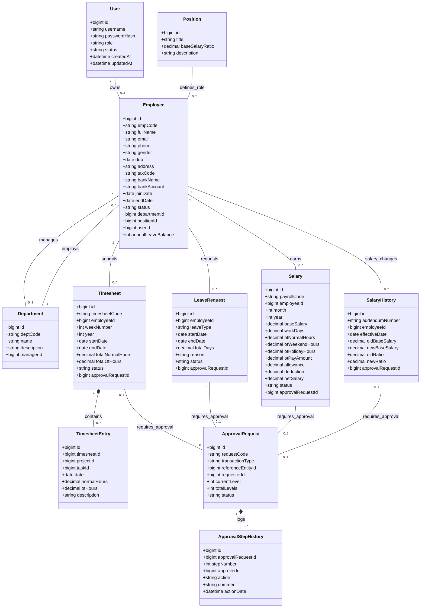

# Class Diagram - HRM System Entity Model

Below is the Mermaid Class Diagram representing the entities, their properties, and their relationships (such as inheritance, association, and composition) as defined in the database schema.

