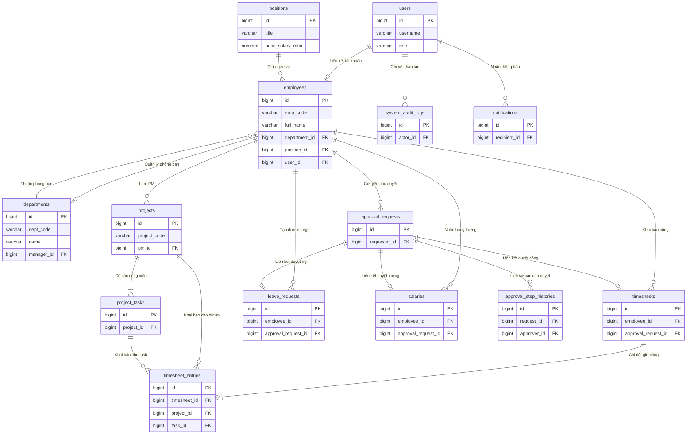

# Sơ đồ Cơ sở Dữ liệu HRM (Database Diagram - Report Edition)

Tài liệu này cung cấp **Sơ đồ Cơ sở Dữ liệu (ERD) rút gọn** theo **chiều dọc (Top-to-Bottom)** và **Bản tóm tắt phân hệ** để đưa trực tiếp vào báo cáo bài tập lớn/đồ án dạng trang A4 đứng.

---

## 📊 1. Sơ đồ Quan hệ Thực thể Chiều Dọc (Vertical ERD)

Sơ đồ sử dụng chỉ hướng `direction TB` (Top-to-Bottom) giúp bố cục các thực thể trải dọc, tránh bị tràn trang và hiển thị rõ ràng hơn trên báo cáo.

---

## 📝 2. Tóm tắt 6 Nhóm Phân Hệ Cơ Sở Dữ Liệu

Hệ thống cơ sở dữ liệu gồm 21 bảng được tổ chức thành 6 phân hệ nghiệp vụ chính:

| STT | Phân hệ (Module) | Các bảng dữ liệu cốt lõi | Vai trò / Nghiệp vụ chính |
| :--- | :--- | :--- | :--- |
| **1** | **Tài khoản & Lưu vết** | `users`, `system_audit_logs`, `notifications` | Xác thực người dùng, phân quyền vai trò (Admin, Chairman, Director, Lead, Employee) và ghi vết thay đổi dữ liệu (Audit Trail). |
| **2** | **Cơ cấu Tổ chức** | `employees`, `departments`, `positions` | Quản lý thông tin hồ sơ nhân viên, sơ đồ phòng ban và hệ số lương theo chức vụ. |
| **3** | **Quản lý Công việc** | `projects`, `project_tasks` | Quản lý thông tin dự án, các hạng mục công việc và phân công PM. |
| **4** | **Khai báo Giờ công** | `timesheets`, `timesheet_entries`, `work_rate_configs` | Ghi nhận giờ công làm việc tiêu chuẩn và làm thêm giờ (OT) theo dự án/công việc; nạp động hệ số tính công. |
| **5** | **Luồng Phê duyệt** | `approval_configs`, `approval_requests`, `approval_step_histories` | Định nghĩa ma trận cấp duyệt động (từ 1 đến nhiều cấp) và lưu vết trạng thái phê duyệt yêu cầu. |
| **6** | **Chế độ & Lương** | `attendances`, `leave_requests`, `salaries`, `job_histories`, `salary_histories` | Chấm công hàng ngày, đơn xin nghỉ phép, quyết toán bảng lương hàng tháng và lưu vết biến động nhân sự/thu nhập. |

---

## 🛡️ 3. Ràng buộc Toàn vẹn Dữ liệu Chính

- **Khóa chính đồng nhất:** 100% sử dụng **Snowflake ID (`bigint`)** giúp hệ thống phân tán đạt hiệu năng tối đa và tự động sắp xếp theo thời gian khởi tạo.
- **Ràng buộc khóa ngoại an toàn:**
  - Sử dụng `ON DELETE RESTRICT` cho các liên kết phòng ban, chức vụ để tránh mất dữ liệu lịch sử nhân sự.
  - Sử dụng `ON DELETE CASCADE` cho các dữ liệu phụ thuộc trực tiếp (như chi tiết timesheet đi liền với timesheet).
  - Sử dụng `ON DELETE SET NULL` đối với người quản lý trực tiếp hoặc người thực hiện phê duyệt để giữ nguyên thông tin bản ghi gốc.
