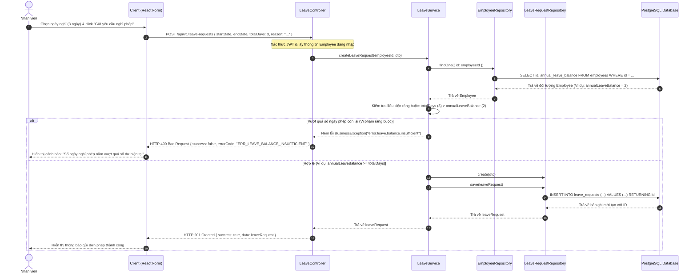

# Sơ đồ Tuần tự 4 - Quy trình Đăng ký Nghỉ phép & Kiểm tra Số dư phép

Sơ đồ tuần tự mô tả chi tiết các bước nhân viên tạo yêu cầu đăng ký nghỉ phép, hệ thống tự động kiểm tra điều kiện ràng buộc số ngày xin nghỉ thực tế so với số dư phép năm còn lại của nhân sự (`annual_leave_balance`) trước khi thực hiện ghi nhận.

