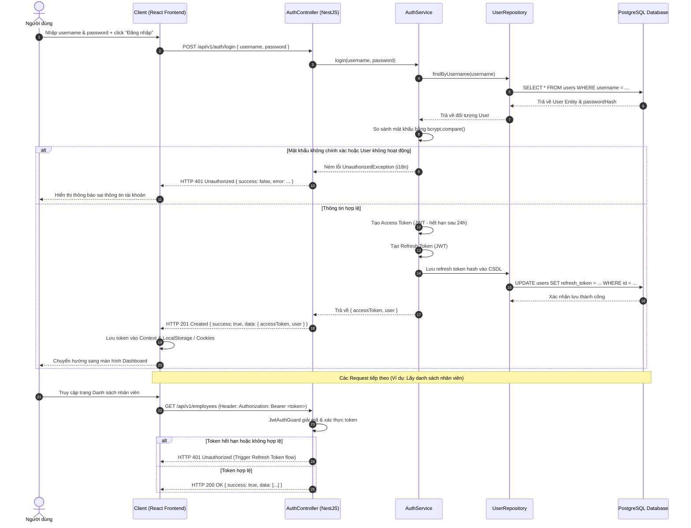

# Sơ đồ Tuần tự 1 - Quy trình Đăng nhập & Xác thực Tài khoản

Sơ đồ này mô tả chi tiết quy trình người dùng đăng nhập vào hệ thống, hệ thống xác thực thông tin tài khoản và trả về cặp mã token JWT (Access Token & Refresh Token) để sử dụng cho các yêu cầu nghiệp vụ tiếp theo.

