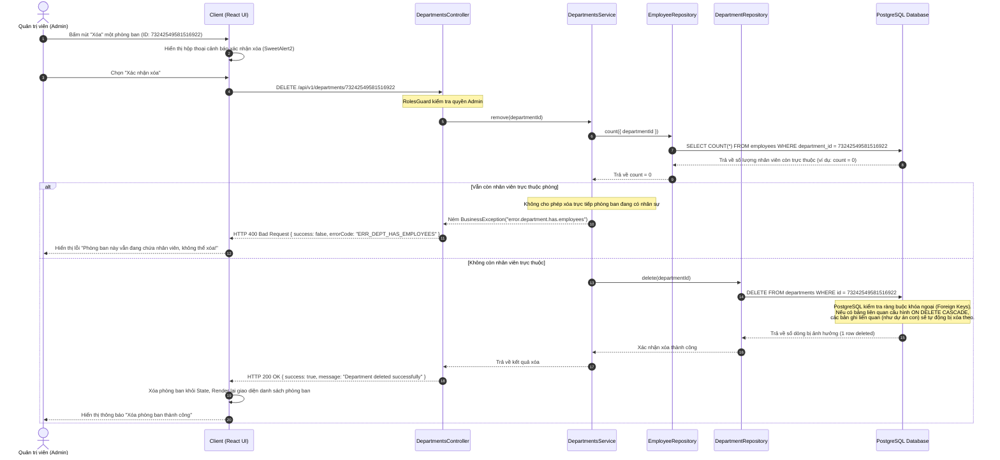

# Sequence Diagram 5 - Delete Entity & Cascading Flow

This diagram details the deletion of a Department, illustrating how NestJS checks for existing employees, executes the delete query, and how foreign keys or soft associations handle cascading relationships.

