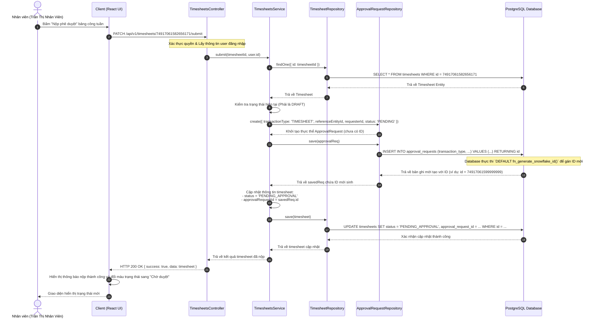

# Sơ đồ Tuần tự 3 - Quy trình Khai báo & Nộp phê duyệt Timesheet tuần

Sơ đồ tuần tự mô tả các bước nhân viên thực hiện nộp bảng chấm công tuần (Timesheet) dự án, hệ thống backend xử lý kiểm tra trạng thái hợp lệ, tự động khởi tạo phiếu yêu cầu phê duyệt đa cấp (`ApprovalRequest`) tương ứng và liên kết các thực thể trong cơ sở dữ liệu.

