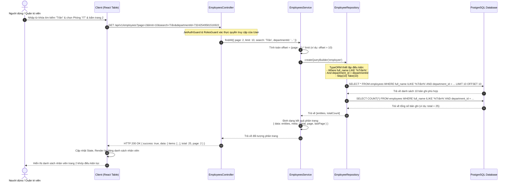

# Sơ đồ Tuần tự 2 - Quy trình Tìm kiếm & Phân trang danh sách Nhân viên

Sơ đồ tuần tự mô tả chi tiết quy trình người dùng tìm kiếm, lọc dữ liệu nhân sự (theo tên, phòng ban) và chuyển trang trên giao diện hiển thị, cách backend xử lý các tham số truy vấn và biên dịch câu lệnh SQL để truy xuất dữ liệu từ cơ sở dữ liệu.

