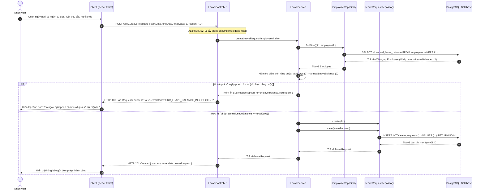

# Sequence Diagram 4 - Update & Check Data Constraints Flow (Leave Balance Validation)

This diagram shows how a Leave Request submission checks the employee's remaining annual leave balance constraint before creating the record or updating the database.

