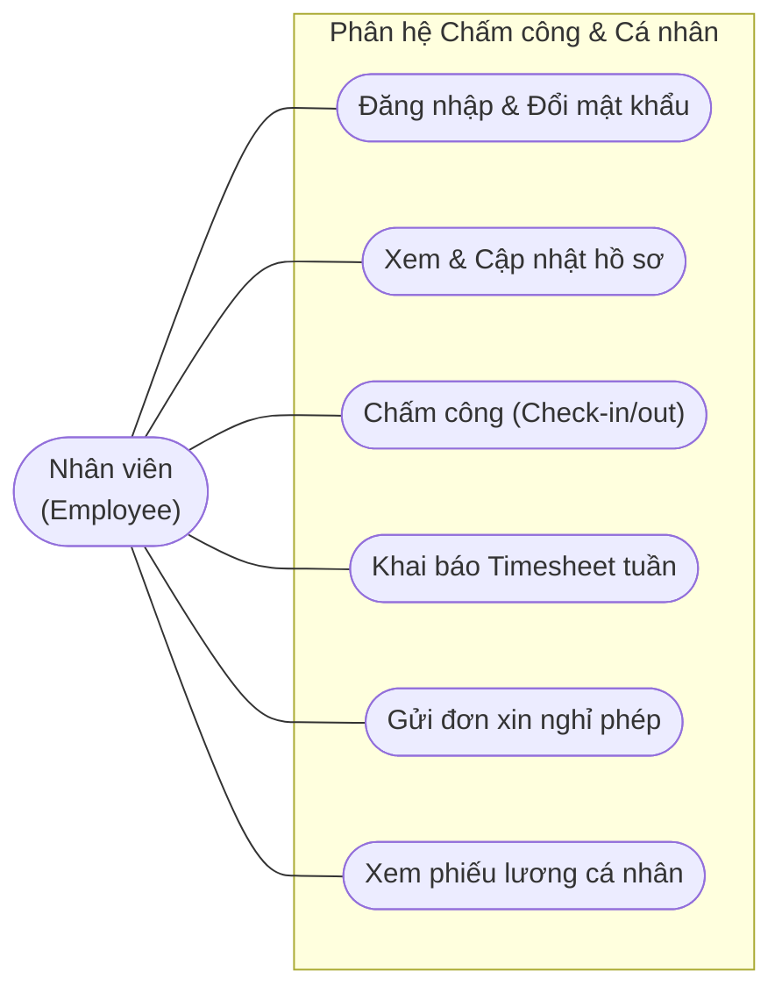
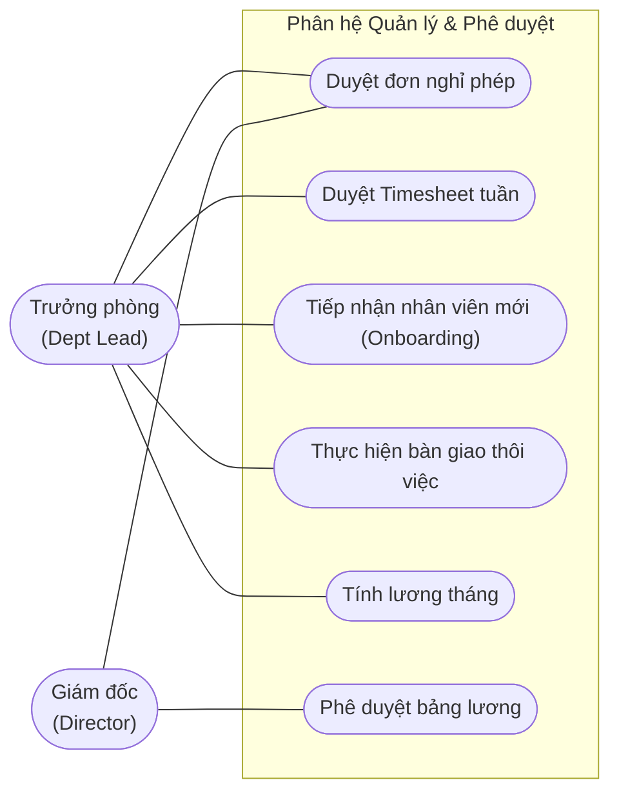
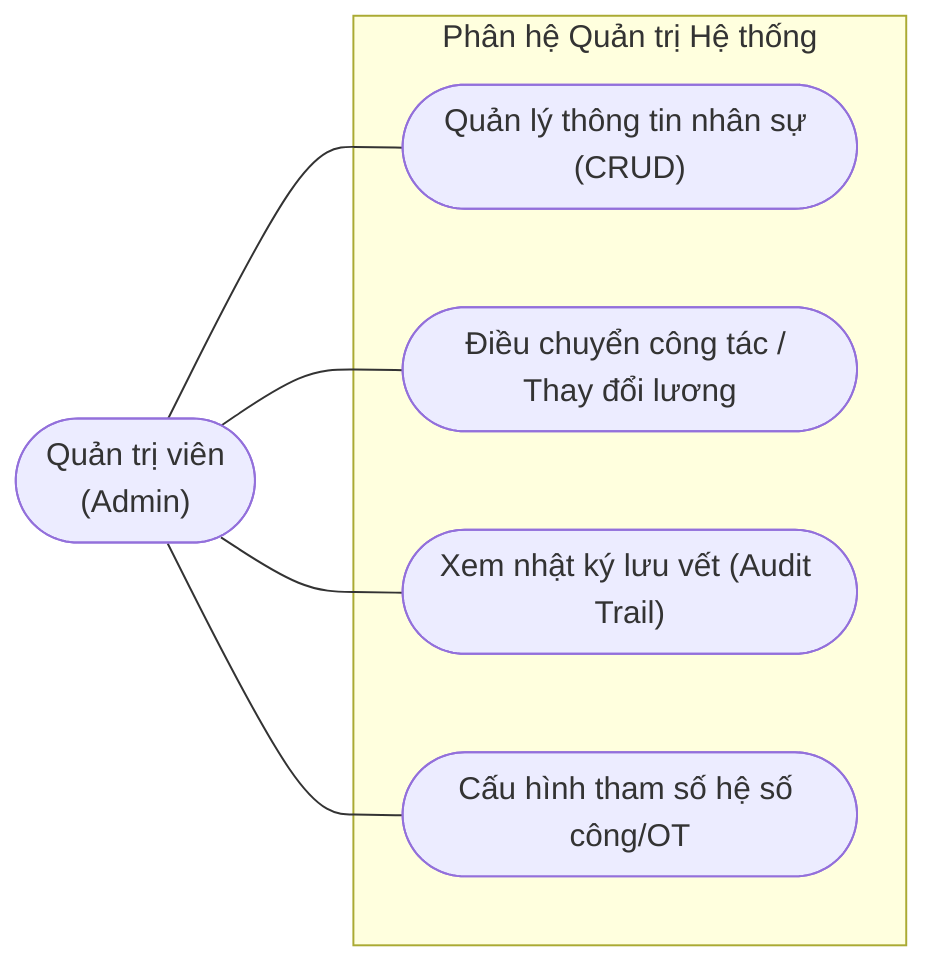

# Sơ đồ Use Case HRM (Use Case Diagram - Report Edition)

Để đảm bảo các sơ đồ không bị quá dài, chữ không bị nhỏ khi chèn vào báo cáo tài liệu (A4), sơ đồ Use Case của hệ thống được cấu trúc lại và chia thành **3 sơ đồ phân hệ độc lập** tương ứng với các nhóm chức năng chính.

---

## 📊 1. Sơ đồ Use Case Phân hệ Nhân viên (Employee Use Cases)

Sơ đồ này biểu diễn các chức năng tự phục vụ (Self-Service) và chấm công dành cho nhân sự thông thường.

---

## 📊 2. Sơ đồ Use Case Phân hệ Quản lý & Phê duyệt (Management & Approvals)

Sơ đồ này mô tả các chức năng quản lý, phân công và luồng phê duyệt đa cấp của **Trưởng phòng** và **Giám đốc**.

---

## 📊 3. Sơ đồ Use Case Phân hệ Quản trị Hệ thống (System Administration)

Sơ đồ dành riêng cho vai trò **Quản trị viên** thực hiện cấu hình hệ thống, quản lý cơ cấu tổ chức và giám sát hoạt động.

---

## 👥 4. Tác nhân & Quyền Hạn Chức Năng (Actors & Permissions)

| Tác nhân (Actor) | Vai trò hệ thống | Phạm vi quyền hạn & Chức năng chính |
| :--- | :--- | :--- |
| **Nhân viên** *(Employee)* | `EMPLOYEE` | - Đăng nhập, đổi mật khẩu và xem/cập nhật thông tin cá nhân. - Thực hiện chấm công hàng ngày (giờ vào/ra). - Khai báo giờ công (Timesheet) làm việc theo dự án hàng tuần. - Gửi đơn xin nghỉ phép và theo dõi phiếu lương cá nhân hàng tháng. |
| **Trưởng phòng** *(Dept Lead)* | `DEPT_LEAD` | - Thực hiện toàn bộ chức năng của nhân viên. - Phê duyệt/từ chối đơn xin nghỉ phép và bảng Timesheet tuần của nhân viên thuộc phòng ban quản lý. - Thực hiện quy trình tiếp nhận nhân viên mới và bàn giao thôi việc. - Tính toán bảng lương tháng của phòng ban trước khi chuyển lên cấp trên. |
| **Giám đốc** *(Director)* | `DIRECTOR` | - Theo dõi toàn bộ danh sách nhân viên và tình hình chấm công trong công ty. - Phê duyệt cấp cao đối với đơn xin nghỉ phép đặc biệt. - Phê duyệt bảng lương tháng cuối cùng của toàn công ty để xuất chi trả. |
| **Quản trị viên** *(Admin)* | `ADMIN` | - Quản lý tài khoản, phân quyền và trạng thái hoạt động của nhân sự. - Quản lý danh mục phòng ban, chức vụ, dự án. - Thực hiện quyết định điều chuyển công tác, điều chỉnh lương nhân viên. - Truy vết lịch sử hoạt động hệ thống qua nhật ký Audit Logs. - Cấu hình các tham số/hệ số giờ công động (`work_rate_configs`). |
